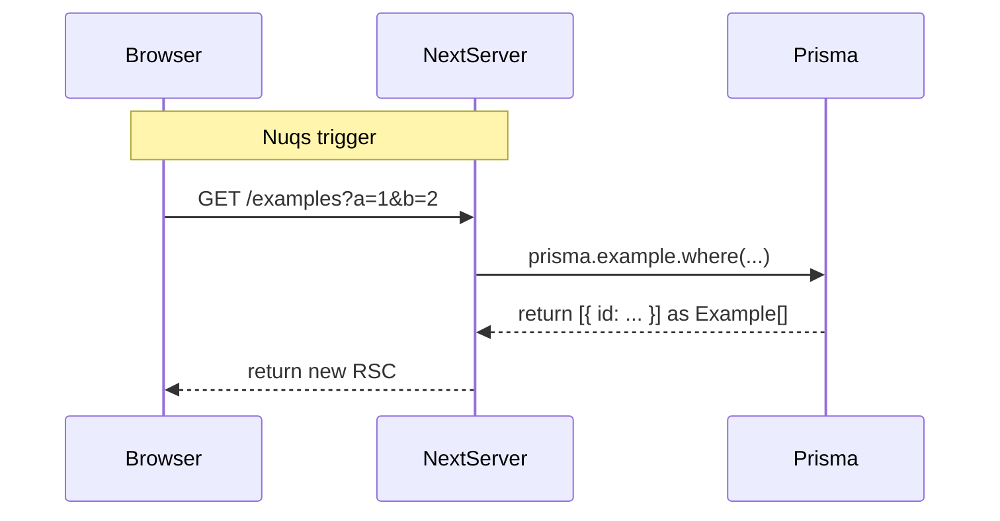
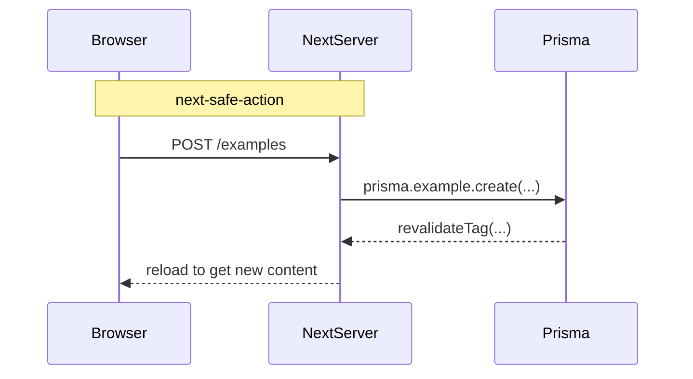

# Request workflows

### GET Requests

```mermaid
sequenceDiagram
  Note over Browser,NextServer: Nuqs trigger
  Browser->>NextServer: GET /examples?a=1&b=2
  NextServer->>Prisma: prisma.example.where(...)
  Prisma-->>NextServer: return [{ id: ... }] as Example[]
  NextServer-->>Browser: return new RSC
```

### CREATE / UPDATE / DELETE Requests

```mermaid
sequenceDiagram
  Note over Browser,NextServer: next-safe-action
  Browser->>NextServer: POST /examples
  NextServer->>Prisma: prisma.example.create(...)
  Prisma-->>NextServer: revalidateTag(...)
  NextServer-->>Browser: reload to get new content
```
