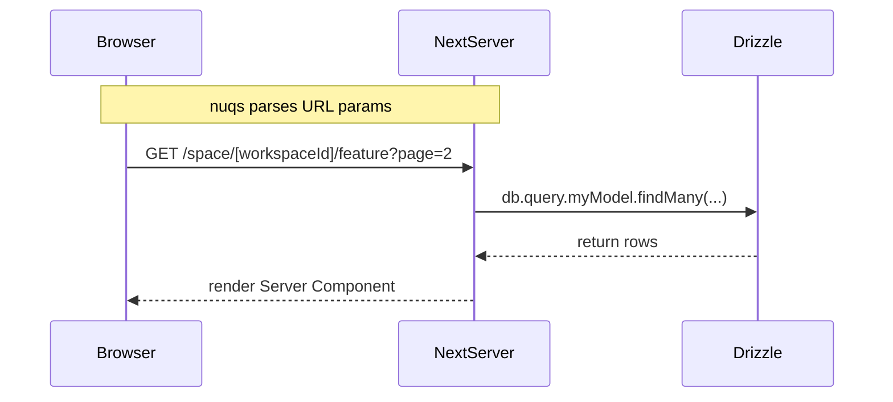
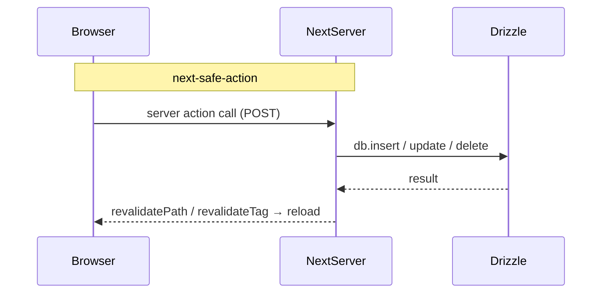
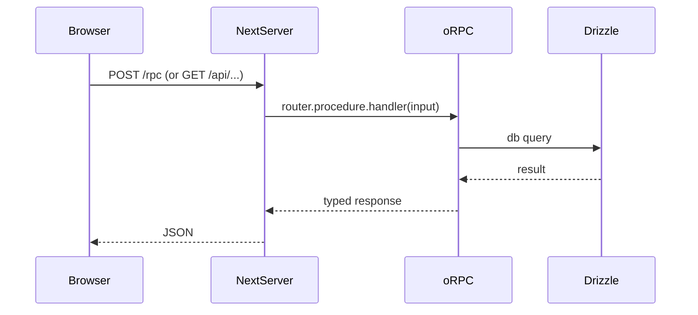
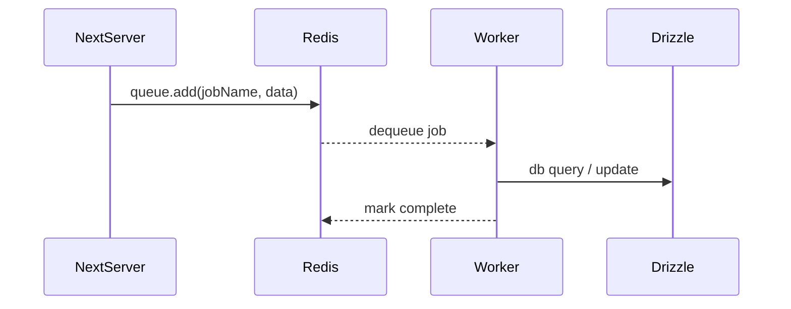

# Request workflows

### GET Requests (Server Component)

```mermaid
sequenceDiagram
  Note over Browser,NextServer: nuqs parses URL params
  Browser->>NextServer: GET /space/[workspaceId]/feature?page=2
  NextServer->>Drizzle: db.query.myModel.findMany(...)
  Drizzle-->>NextServer: return rows
  NextServer-->>Browser: render Server Component
```

### Mutations via Server Actions (next-safe-action)

```mermaid
sequenceDiagram
  Note over Browser,NextServer: next-safe-action
  Browser->>NextServer: server action call (POST)
  NextServer->>Drizzle: db.insert / update / delete
  Drizzle-->>NextServer: result
  NextServer-->>Browser: revalidatePath / revalidateTag → reload
```

### API Requests via oRPC

```mermaid
sequenceDiagram
  Browser->>NextServer: POST /rpc  (or GET /api/...)
  NextServer->>oRPC: router.procedure.handler(input)
  oRPC->>Drizzle: db query
  Drizzle-->>oRPC: result
  oRPC-->>NextServer: typed response
  NextServer-->>Browser: JSON
```

### Background Jobs (BullMQ)

```mermaid
sequenceDiagram
  NextServer->>Redis: queue.add(jobName, data)
  Redis-->>Worker: dequeue job
  Worker->>Drizzle: db query / update
  Worker-->>Redis: mark complete
```
