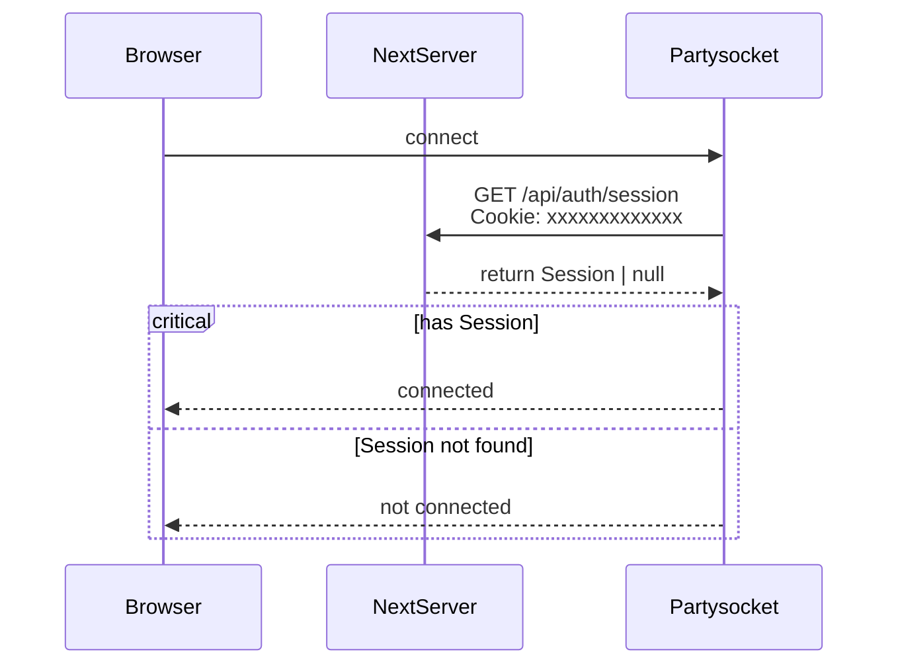
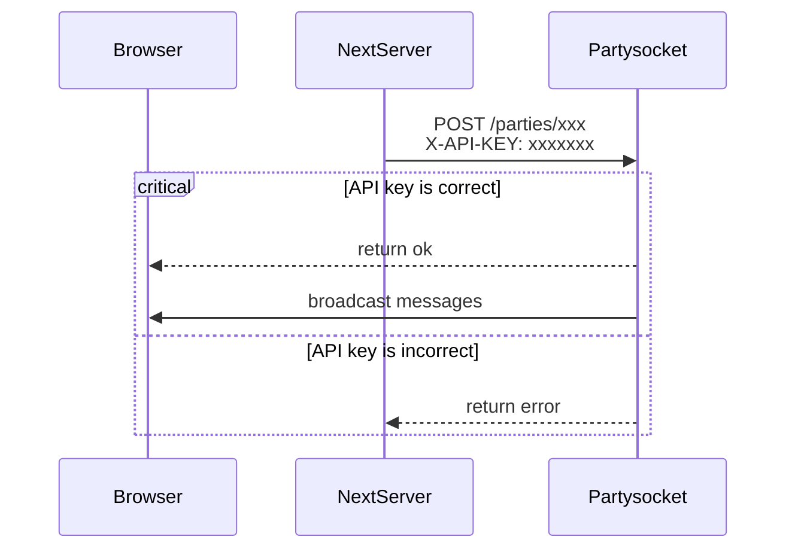

# Implement websocket

### Browser connect websocket

```mermaid
sequenceDiagram
  participant Browser
  participant NextServer
  participant Partysocket

  Browser->>Partysocket: connect
  Partysocket->>NextServer: GET /api/auth/session <br/> Cookie: xxxxxxxxxxxxx
  NextServer-->>Partysocket: return Session | null
  critical has Session
    Partysocket-->>Browser: connected
  option Session not found
    Partysocket-->>Browser: not connected
  end
```

### Broadcast messages

```mermaid
sequenceDiagram
  participant Browser
  participant NextServer
  participant Partysocket

  NextServer->>Partysocket: POST /parties/xxx <br> X-API-KEY: xxxxxxx
  critical API key is correct
    Partysocket-->>Browser: return ok
    Partysocket->>Browser: broadcast messages
  option API key is incorrect
    Partysocket-->>NextServer: return error
  end
```
